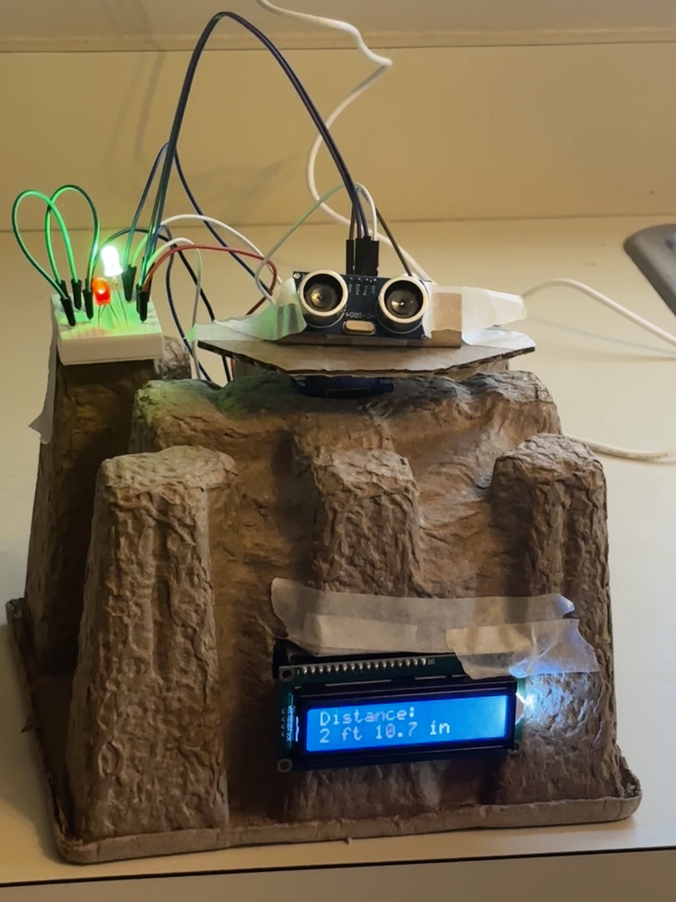
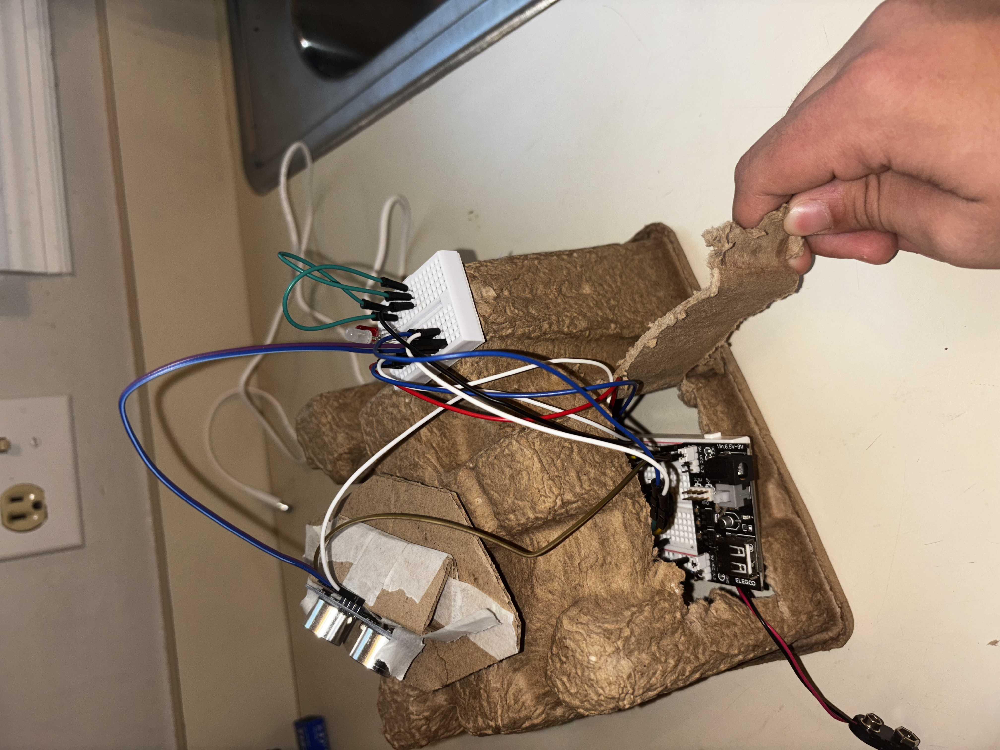
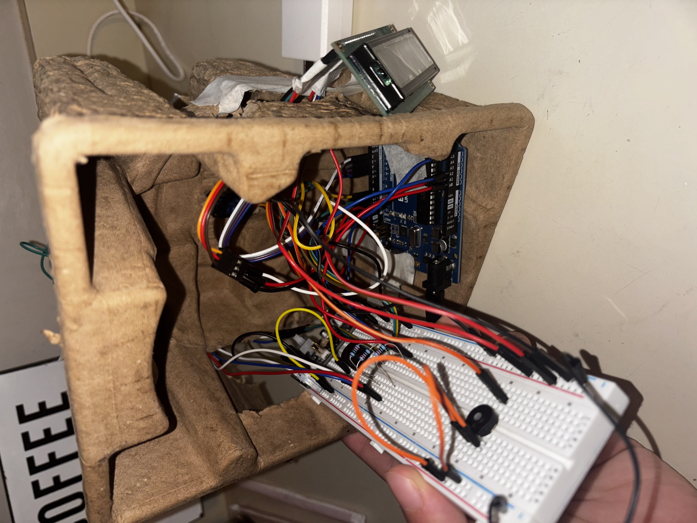

# Arduino Proximity Scanner

An Arduino-based embedded system that continuously scans its surroundings, measures object distance, and provides visual and audible warnings based on proximity.

## Project Overview

This project was built to practice embedded systems programming and integrating multiple hardware components into one system.

A servo motor continuously sweeps an HC-SR04 ultrasonic sensor across an area. The sensor measures object distance, while a 16x2 LCD displays the current measurement. An RGB LED and passive buzzer indicate different proximity levels.

## Current Features - Version 1

- Continuous servo scanning from 20° to 160°
- Real-time ultrasonic distance measurement
- Distance displayed in feet and inches on a 16x2 LCD
- Green indicator for safe distances
- Yellow indicator for the warning zone
- Red danger state for close objects
- Audible warnings with different beep rates based on distance
- Non-blocking timing using `millis()`
- Modular C++ functions for each subsystem

## Hardware

- Arduino Uno
- HC-SR04 ultrasonic sensor
- Servo motor
- 16x2 LCD display
- Common-cathode RGB LED
- Passive buzzer
- Potentiometer
- Breadboard
- Resistors
- Jumper wires
- External breadboard power supply

## How It Works

The servo continuously sweeps the ultrasonic sensor between 20° and 160°.

The ultrasonic sensor sends a pulse and measures how long it takes for the echo to return. The Arduino uses this measurement to calculate the object's distance.

**Safe:** Green LED, buzzer off

**Warning:** Yellow LED, slow audible warning

**Danger:** Red LED, faster and higher-pitched audible warning

The measured distance is simultaneously displayed on the LCD in feet and inches.

## Software Structure

- `updateServo()` - controls scanning motion
- `measureDistance()` - reads the ultrasonic sensor
- `updateLCD()` - displays the current distance
- `updateWarningSystem()` - determines the warning state
- `updateBuzzer()` - controls non-blocking audible alerts
- `setColor()` - controls the RGB LED

Using `millis()` allows multiple parts of the system to operate without relying heavily on blocking delays.

## Known Hardware Issue

The red channel of the RGB LED used during Version 1 testing is currently nonfunctional due to a hardware issue with the LED itself. The warning-state logic is implemented in software, but the LED will be replaced.

## Project Build

### Hardware Setup

  
  

## Next Steps - Version 2

The next version will expand the scanner from simple proximity detection to object tracking:

- Detect an object while scanning
- Stop the normal sweep when an object enters the warning area
- Follow the object's movement with the servo
- Detect when the object has been lost
- Automatically return to scanning mode

## Project Status

**Version 1: Working**

Version 2 object tracking is currently planned.
